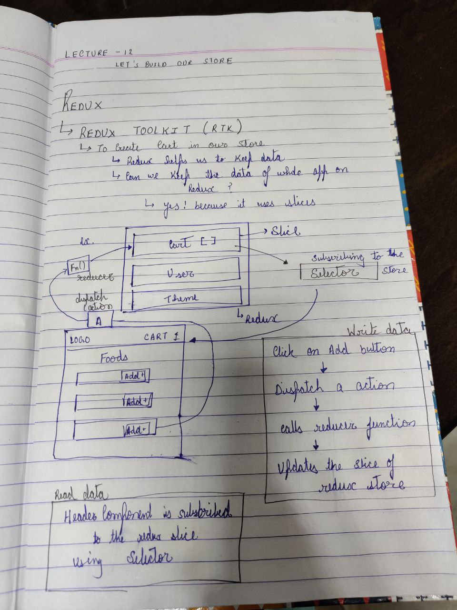

# React Learning Notes 

## To get parcel and Get React
- npm init
- npm install -d parcel . -d ka mtlb hai dev dependencies chaiye
- npm install react
- npm install react-dom


## Parcel
- Dev Build
- local Host
- HMR =Hot Module Replacement
- File Watching Algorithm - written in C++
- Caching - Faster Builds
- Image Optimisation
- Minification
- Bundling 
- Compressing
- Consistent Hashing
- Code Splitting
- DIffrential Bundling -support older browsers
- Error handling
- HTTPS
- Tree Shaking - remove unused code
- Diffrent dev and prod bundles
    1. to create dev files we removed main from package 
    

## Browser List
[It will tell you about the values to add in package.json .it is added as a key pair ](https://browserslist.dev/?q=bGFzdCAyIHZlcnNpb25z)


# Lecture 3

-we can use script command for npm shotcuts for example
```javascript
"scripts": {
    "test": "jest",
    "start" : "parcel  index.html"  
  },
```
-now we can just write npm run start .There is also a shortcut only for start we can write npm start.

-JSX code mai notes hai 

-react components

# Lecture 4

- css in js

### props in js
  -they are using function arguments type 

### Config-driven UI
  - acoding to diffrent data from backend you can show different ui
  - for example swiggy will have diffrent coupens aur corousals (which show offers) based on the data they get from server in diffrent cities

## Data from swiggy(key is imp)
  -map 
    -key : maanlo bohot saara data hai agar key nahi hogi toh har baar react uss data ko render karega 100 baar hai toh 100 baar render karega isliye apan key de dete hai jab bhi koi naya data aaya toh woh apni key ke hisab se arrange ho jaaye
    -also never use array index as your keys
    [reason by react.org](https://robinpokorny.com/blog/index-as-a-key-is-an-anti-pattern/)

## React Fragment(Assignment)
  -React Fragments are a component in React that allows you to group a list of children without adding extra nodes to the DOM. This can be useful when rendering multiple child elements/components in a single parent component.
  ```javascript
    function Parent() {
      return (
        <>
          <Child1 />
          <Child2 />
        </>
      );
    }
  ```

## Virtual DOM
- The VDOM is a programming concept that keeps a virtual representation of a user interface (UI) in memory. It's a tree that represents the structure and content of a website
- html ka tree type structure banake rakhna 

## React Reconciliation
- React reconciliation is the process of comparing the current state of the UI (virtual DOM) with the desired state (new virtual DOM) and figuring out the most efficient way to update the real DOM to match the desired state. This process is what makes React so fast and efficient, as it avoids unnecessary DOM updates.

## React Fiber
- React Fiber works by breaking down the rendering process into smaller chunks, called fibers. Fibers are units of work that can be scheduled and executed independently. This allows React to prioritize and render the most important parts of the UI first, while keeping the rest of the UI responsive.

## React without JSX
[Reason](https://legacy.reactjs.org/docs/react-without-jsx.html)


# Lecture 5

- Two Type of Export / Import

  1. Default export/import
    ```javascript
    export default Component_name
    import  Component_name from 'module'
    ```

  2. Named Export Import
    ```javascript
    export const component_name
    import {component_name} from 'module'
    ```

- Adding Event to Console

## React Hooks
  - Adding event to ui 
  - using super powerful element
    - body ke andar state variable likha hai
    time stamp: -55 minuter
- Normal Js Function 
  1. useState() - Superpowerful State Variable in React  (whenever a state variable updates react re renders  the component)
    - when it is called or changed either it is const the whole header or body function render again in a split of second 
    - this is the reason why we can write const as a state variable even when it is changing
  2. useEffect() next lecture

  ### React Reconciliation (diff algorithm) algorithm
      - it comapres the virtual dom with the new dom created and do the nessary changes 
      - introduced in react 16
      [Link for whole article about it](https://github.com/acdlite/react-fiber-architecture)

# Lecture 6

## Monolith and Microservices Architecture
  1. Monolith
      - in this every system work(API , UI, Authentication) inside a same project , also need to use same language for full backend and frontend 
        
  2.  Microservice 
      - Here everythiing has its own environment like backend can be on any langauge
      - and further they all can be connected to each other using API calls
        

## Two ways to approach api connection
  1. Load the website ==> call the Api (which takes approx 1 sec) ==> render The website 
      - here our website takes about 1 sec to fetch all api and start the website
  
  2. load the website ==> render site ==> call Api ==> render again
      - here we have our website but we are rendering twice which is not at all a headache because react is awesome at rendering ui we already saw that in previous lecture 

## use Effect
  - in body.js

  - when we were accessing data directly from swiggy website it gives a error it is CORS Policy
  


  [Video Of akshay on cors](https://www.youtube.com/watch?v=tcLW5d0KAYE)

  ### CORS (Cross Origin Resource Sharing)
    - our web browsers wont allow the sharing of data from one origin to another origin (Origin can be any other domain ,or any sub domain , or other ports ,or diffrent protocols)

  - After cors extension
  - we connected the swiggy api data with our app using fetch 
    - Learn optional chaining
  - we can also use corsproxy from
  []()

  -we can add a loading in place of our res data and now there is no use of mock data 
  - or in place of loading we can show ==Summering UI==
 
- Header pe useState ka use aur login logout button banaya 

- Search Button banya usme jo jo dikhat aayi code mai body.js mai fetch class ke andar 

# Lecture 6.1 

- whenever we get data from swiggy it give us limited data 
- there is a update json in network whenever we scroll 
- this update is having request method as post and not get so we use fetch post api using the link below 
  [to fetch a Post Api](https://developer.mozilla.org/en-US/docs/Web/API/Fetch_API/Using_Fetch)


# Lecture 7

## UseEffect and dependecy array
 - when there is no dependency array => every time header is render it will be called
 - when there is empty dependency array => it is called on initial render(just once)
 - when it is filled with a use state variable => it will render everytime useState variable is changed 

## UseState 
  - initials it inside our  function component i.e.  body or header etc
  - always keep it in starting of your code
  - never use it inside a scope for example (if or for loop)
 
## Routing
- install react router dom using "npm install react-router-dom"
- it will be in package dependencies
- now import two data 
```javascript
import { createBrowserRouter,RouterProvider } from "react-router-dom"
// aage ka code mai hai main.js mai
``` 

- iske baad about aur contact us banya 
- per agar hum /priyash likhenge toh ek error aa raha hai jisko apan manipulate kar sakte hai
  !(Error Before)[./Notes/Screenshot%202024-03-07%20011618.png]

- we import a hook useRouteError in our error.js to get the error

- Outlet - using something as a chilren of another tag 
  - as seen in code

- never use <a> tags in your jsx code because this will reload our page <mark>IMP</mark>
- instead of that you can use link which is a tag provided by react router dom this will not roload the page but only change the component of the page
- this is reach web apps are called <mark>Single Page Application (SPA)</mark>

### Two Types of routing
 - Client side Routing -  
 - Server Side Routing - it reloads the page because it fetch the data from server

## Creating Menu Page 
  - Firstly create a menu page 
  - adding this is path but it is added in diffrent because we need diffrent menu for diffrent restuarants
    - there is diffrent res menu for other restuarants so we use ":" in main.js

  - Now fetch the data and use it inside our menu
  - something known as graphql it helps us to get data easily which is inside a object
  - now similar fectching the data and return it in our ui

- Now to get diffrent Ui for diffrent restuarants we used there id which was taken from useparams from react-routing dom and this param is the resid which was given in main.js >chilren>path>restuarant/:resid


# Lecture 8

## Class Based Component
- we studied functional based
- expamle is UserClass in About us 
- using props is diffrent in class
 - why we used super keyword here?

- State Variables in class (this.state) in code ./UserClass
- if there are many state variables and we are updating any 1 then it will render only that one and wwont even touch any other

- when we call the class first constructor and then render(every thing inside a component is called) is called and at last componentdidmount is called
- why componend did mount is used it is similar to useEffect i.e. for calling api
- some exception 
  -React Lifecyle Diagram 
  (Diagrm Link)[https://projects.wojtekmaj.pl/react-lifecycle-methods-diagram/]
  - Also Used console logs in my code
  <!-- 
  Parent Constructor Called
  Parent Render Called

    Priyash (class)Constructor Called
    Priyash (class)render Called

    ElonConstructor Called
    Elonrender Called
    
    Priyash (class)componentDidMount called
    EloncomponentDidMount called
    
  Parent componentDidMount called
   -->

- we fetched the api from github and used it in componentDidMount 
- further there is a function componentDidUpdate which is used in updating phase (See The diagram url above)
    <!-- Mounting
          constructor(dummy)
          render 
            <html Dummy>
          component did Mount
            api call
            this.state -> state variable updated

        UPDATE
          render(APi DAta)
          <html (new API)>
          component did updaate
     -->
- also a componentWillUnmount is called after the changing the page or when component is disappered(unmount)

### Imp points from Old Live Lecture

- Never compare a functional component with class component
- when componentDidMount is called it is updated once 
- and to update it we use componentDidUpdate
- so Now we write 
```javascript 
useEffect(()=>{
  //API Calls
},[count]);
```

- earlier it was
```JSX
componentDidUpdate(prevProps,prevState){
  if(this.state.count!= prevState.count){
    //code
  }
}
```

- what if we create a setInterval Inside componentDidMount
- many will say it will run till we are on about us page 
- But React is a single page application so even if you change to home the interval will run
- so we need to clear interval and this is done on COMPONENT WILL UNMOUNT

- even in new useEffect if we use set interval it too wont stop even if we chaange the page 
- now how to clear the interval it is used using a return function i.e.
```javascript
useEffect({
  const timer=setInterval(()=>{
    console.log("Namaste React OP");
  });

  return ()=>{
    clearInterval(timer);
  };
},[]);
```

- why did we write async before function in class based and async before fetching in function based 
- use of super Keyword (Link For article)[https://www.geeksforgeeks.org/what-is-the-use-of-superprops/]


# Lecture 9

- Single responsibility principal : jisko jo kaam hai whii de koi bug aaya toh fatak se solve ho jayega kyoki sabka code alag hai
    - code becomes reusable , mantanaible and testable

## Creating Custom Hooks
- lets create a hook to fetch the resid in restuarantMenu
- the code is in utils named - useRestuarantMenu.js

- using a online status hook to tell if online or not 
 -we will use it in our headeer as well as body

 ### Part 3

- Is it mandatory to write use in hooks well it is not nessary but using hooks require the word use otherwise the linter in react will get confuse 
- also react library say to use use

### Part 4
- parcel does the bundling of the code and write it in 1 js file 
- but the file size is too heavy to haandle 
- and so we break the js in small diffrent diffrent code
- this is called <mark> chunking ,code spliting ,dynamic bundling ,dynamic import</mark>

- We will make a grocery page which will have a diffrent js
- now we will import this only when it is needed using lazy loading or on demand loading 
(Lazy and suspence documentation)[https://react.dev/reference/react/lazy]
- we are using suspence because react is fast and it did not find grocery in our code and give a error
- code in main.js

# Lecture 10 

- making our app look buitiful 
- using normal css
- using sass and scss (Documentation)[https://sass-lang.com/guide/]
- styled components (Documentation)[https://styled-components.com/]
- material ui (pre build components) ,bootstap ,chakra ui

## Tailwind CSS
- installing tailwind using (Link for guide)[https://tailwindcss.com/docs/guides/parcel]
  - npm install -D tailwindcss postcss
  - npx tailwindcss init                   -- postcss is used for tranforming css in js

  - create a file for .postcsssrc
  - further spets from decumentation
  - now add a extension tailwind css intellisense 

  - now we can use tailwind freely 
- why tailwind ???
  - lightweight (include only the css which is required)
  - build complex ui
  - all features are present on tailwind's site

# Lecture 11

## Higher Order Component 
- it is a function which takes some input enhances it and then returns it back
- in restuarant card we added the promoted tag
## Next
- now we create a full menu 
- i.e acodian data 

## React Devloper Tool 

- About components and profilers

## Controlled and uncontrolled components

 - at point now when show itmes is used inside our restuarant category it is uncontrolled 
 - and when it is used inside restuaraant menu it is controlled item  

## Lifting State up
- it is using our parent to make changes in child 
- we made controlled function of accodian using it in restuarant menu
- used resturant menu to control itemList

## Problem of Props Drilling
- Example :- to get a data from resturant menu to item list we need to create to many props to get the data till end
- to solve this issue we use context

### useContext Hooks
- it is used to access the data througout the page 
- we made a context named usercontext in utils

- in class based Component the hook is added diffrently
```jsx
<div>
  LoggedInUser :
    <UserContext.Consumer>
      {({LoggedInUser}) => <h1 className="font-bold">{LoggedInUser}</h1>}
    </UserContext.Consumer>  
</div>
```

- now to update this info (contextprovider)
- we will do it in main.js

- if we are using 2 or three context 
```jsx
// Default Context Value 
<UserContext.Provider value={{LoggedInUser : userName}}>
  {/*Priyash Sharma */}
  <div  className="body">
    <UserContext.Provider value={{LoggedInUser : "Elon Musk"}}>
    {/* Elon Musk */}
      <Header/>
    </UserContext.Provider>
      
    <Outlet />
  </div>
</UserContext.Provider>
```

- also we made something to change the value of user

### Redex
- state managemnet library
- learn in next video


# Lecture 12

## Redux
- it is not mandatory 
- and redux is not react 
- redux and react are diffrent libraries
- It is used to store data 
- there is one more similar library named zustand
- [Zustand](https://github.com/pmndrs/zustand)

- Redux offer easy debugging  

- Creating Cart



- Install @reduxjs/toolkit and react-redux
- build our store 
- connect our store to our app
- slice (cart slice)
- dispatch(action)
- Selector 

- creating the store(Configure Store -redux library)
- creating slice (createSlice- from redux library)
- adding provider to main.js (from react-redux)
- adding selector to header for using redux (using useSelector hook from react-redux)
- in item list modifying the add button
 - we will add an on click event and a callback function
 - also add a dispatch hook from react-redux

- NOTE:-
       - You Must Know
       - what is the diffrence between 
          onClick(()=>handleClick(item));
          onClick(handleClick(item));
          onClick(handleClick);
          in javascript 
       - Else Chatgpt it

- Now adding the actual item to our store 

### MIStakes

1. Selecting whole store
  - we wrote the code as
  ```javascript
  const cartItems=useSelector((store) => store.cart.items);
  ```
  - we can also write 
  ```javascript
  const store=useSelector((store) => store);
  const cartItems =store.cart.items ;
  ```
  but this is very less efficient 
  - because if you make changes in your store the whole will render again

2. reducer is used in appstore (i.e main store file )
- and reduces are used in slice and only one of the reducer is exported

3. Mutating the state was not posible in vanila redux (older redux) 
  - But Now it is Mandatory 
  - older 
  ```javascript
  //Vanilla redux gives a error => DON'T MUTATE STATE
  const newState=[...state];
  newState.items.push(action.payload);
  return newState 
  ```
  - read immer which is used by redux toolkit
  - check the cartSlice.js also

4. if we console.log(state) redux wont allow us to see it 
 - we need to import current from reduxjs/toolkit 
 - and need to do condole.log(current(state));

5. add redux devtools helps a lot in debugging

### HOme WOrk
- read about rtk query

# Lecture 13

## TESTING 

- Types of Testing 
 - Manual Testing : to use ,each component we build manually ans it is not efficeint way
 - Coding (Devloper Testing) : using code to test 
  - Diffrent type of Devloper Testing 
   - Unit Tessting
   - Integration Testing  
   - End to End Testing - e2e testing


## Setting up our tesing
- Install React Testing Library (search on google) 
 - React Testing Library works on DOM Testing Library and DOM Testing Library works on JEST
 - npm i -D @testing-library/react

- INstall Jest 
  - Since we are using jest with babel(Bundler) 
  - npm i -D jest
- Install extra dependencies of babel
- configure Babel
 - since we are using babel with parcel so when we configure it with jest ,the parcel configure will collide with it 
- Go to parcel website search for javascript inside it go to babel and go to usage with other tools 
- and create the new file
 
- Jest Cofiguration
  - npx jest --init
   - no to typescript 
   - jsdom (it is like browzer or virtual browser )(search on google)
   - yes covering reports
   - babel
   - y
- Install Js-dom (in >>Setup >> jest 28)

## USing Testing
- lets create a sum.js to test it 
- to test it we create a file named __test__ (here the underscores like this are called dunder)
- further in sum.test.js after creating sum.js for testing on js

## UNIT TESTING
- checking that it renders the contact us page or not 
- in contact.test.js
- when we run the test it fails becuase it cannot work on jsx 
- so we install a library
- npm i -D @babel/preset-react
- configure babel.config.js
- install testing-library/jest-dom
- did some test cases in contact.test.js

- Now to create multiple test cases - describe
- Describe can be used to keep diffent test cases and we can use describe inside describe as well
- we can also write it in place of text

- keep coverage in gitignore 

### Part -6
- Checking header in header.test.js
  - while testing header we collide with twwo error 
   1. we are using redux in our header so we need to add provider 
   2. we are using link which comes from react-router dom se we add browser router from react router dom

- Check header.test.html 

### Part-7
- checking restuarantCard

## Integration Testing
- to test the search function we mad eto filter out restuarant
- Search.test.js
- our body is fetching a promise which can be done on browser but testing created a jest-dom which is like browser and not browser 
- and so we will edit our promise as done in code - search.test.js

- Also creating constant watch on testing by writing in parcel
```javascript
  "scripts": {
    "test": "jest",
    "start": "parcel Main.html",
    "build": "parcel build Main.html",
    "watch-test" : "jest --watch" // yeh kiya hai add
  },
```
- ab run kro npm run watch-test
- now on running we see out state function cant be runned
- get back to search.test.js to know more 

- learned using test id to accesss element (data-testid)

### Part-8
- in contactUs.test.js we will learn about beforeAll() ,beforeEach(), afterAll(), afterEach()

### Part-9
- lets create a Added to cart test

- TO watch the coverage Report i.e. how much we have checked we can go to coverage>>Icov-report>>index.html (open it with live server)

