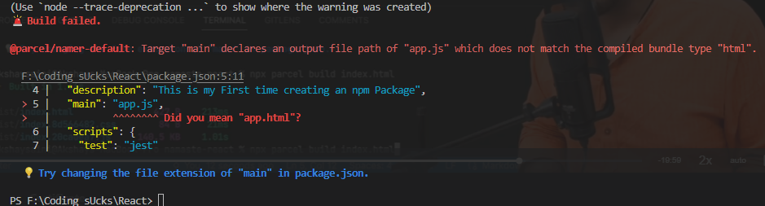

# React Learning Notes 

## To get parcel and Get React
- npm init
- npm isntall -d parcel . -d ka mtlb hai dev dependencies chaiye
- npm install react
- npm install react-dom


## Parcel
- Dev Build
- local Host
- HMR =Hot Module Replacement
- File Watching Algorithm - written in C++
- Caching - Faster Builds
- Image Optimisation
- Minification
- Bundling 
- Compressing
- Consistent Hashing
- Code Splitting
- DIffrential Bundling -support older browsers
- Error handling
- HTTPS
- Tree Shaking - remove unused code
- Diffrent dev and prod bundles
    1. to create dev files we removed main from package 
    

## Browser List
[It will tell you about the values to add in package.json .it is added as a key pair ](https://browserslist.dev/?q=bGFzdCAyIHZlcnNpb25z)


# Lecture 3

-we can use script command for npm shotcuts for example
```javascript
"scripts": {
    "test": "jest",
    "start" : "parcel  index.html"  
  },
```
-now we can just write npm run start .There is also a shortcut only for start we can write npm start.

-JSX code mai notes hai 

-react components

# Lecture 4

- css in js

### props in js
  -they are using function arguments type 

### Config-driven UI
  - acoding to diffrent data from backend you can show different ui
  - for example swiggy will have diffrent coupens aur corousals (which show offers) based on the data they get from server in diffrent cities

## Data from swiggy(key is imp)
  -map 
    -key : maanlo bohot saara data hai agar key nahi hogi toh har baar react uss data ko render karega 100 baar hai toh 100 baar render karega isliye apan key de dete hai jab bhi koi naya data aaya toh woh apni key ke hisab se arrange ho jaaye
    -also never use array index as your keys
    [reason by react.org](https://robinpokorny.com/blog/index-as-a-key-is-an-anti-pattern/)

## React Fragment(Assignment)
  -React Fragments are a component in React that allows you to group a list of children without adding extra nodes to the DOM. This can be useful when rendering multiple child elements/components in a single parent component.
  ```javascript
    function Parent() {
      return (
        <>
          <Child1 />
          <Child2 />
        </>
      );
    }
  ```

## Virtual DOM
-The VDOM is a programming concept that keeps a virtual representation of a user interface (UI) in memory. It's a tree that represents the structure and content of a website

## React Reconciliation
- React reconciliation is the process of comparing the current state of the UI (virtual DOM) with the desired state (new virtual DOM) and figuring out the most efficient way to update the real DOM to match the desired state. This process is what makes React so fast and efficient, as it avoids unnecessary DOM updates.

## React Fiber
- React Fiber works by breaking down the rendering process into smaller chunks, called fibers. Fibers are units of work that can be scheduled and executed independently. This allows React to prioritize and render the most important parts of the UI first, while keeping the rest of the UI responsive.

## React without JSX
[Reason](https://legacy.reactjs.org/docs/react-without-jsx.html)


# Lecture 5

- Two Type of Export / Import

  1. Default export/import
    ```javascript
    export default Component_name
    import  Component_name from 'module'
    ```

  2. Named Export Import
    ```javascript
    export const component_name
    import {component_name} from 'module'
    ```


